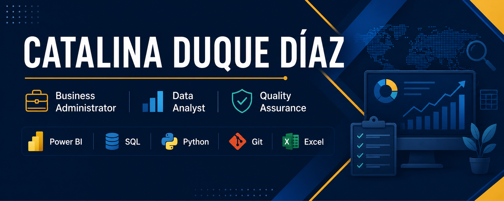

# catalinaduquediaz-svg
Business Administrator | Data Analyst | QA | Power BI | SQL | Python

  

<h1 align="center">¡Hola! 👋 Soy Catalina Duque Díaz</h1>

<h3 align="center">
Business Administrator • Data Analyst • Quality Assurance
</h3>

Transformo datos en información para apoyar la toma de decisiones, optimizar procesos y mejorar la experiencia del usuario.

---

# 👩‍💼 Sobre mí

Soy **Administradora de Empresas** con más de **20 años de experiencia** en operaciones comerciales, servicio al cliente, coordinación administrativa, gestión de indicadores y mejora de procesos.

Actualmente estoy fortaleciendo mi perfil en **Data Analytics** y **Quality Assurance**, combinando mi experiencia en procesos de negocio con herramientas de análisis de datos, automatización y pruebas funcionales.

Me apasiona comprender cómo funcionan los procesos, identificar oportunidades de mejora y convertir los datos en información útil para apoyar la toma de decisiones.

---

# 🚀 Proyecto Profesional Destacado

## ⭐ Transformación Digital de Kaboom Bogotá

Proyecto real de transformación digital en el que participé en:

- Levantamiento de requerimientos.
- Análisis funcional.
- Validación de procesos.
- Pruebas QA / UAT.
- Implementación de herramientas de Inteligencia Artificial.
- Optimización de procesos operativos.

### Tecnologías utilizadas

- Power Platform
- Notion
- Inteligencia Artificial Generativa
- QA Funcional
- Gestión de Procesos

📖 **Documentación completa:** *https://app.notion.com/p/Transformaci-n-Digital-de-Kaboom-Bogot-3c8ea9f7feee80ea976bf68c7a4ae5cb*

---

# 📊 Portafolio de Proyectos

## 📈 Dashboard Comercial de Ventas

Proyecto desarrollado en **Power BI** para analizar indicadores comerciales, ventas y rentabilidad.

**Tecnologías**

- Power BI
- DAX
- Power Query

🔗 Repositorio: *https://app.notion.com/p/Dashboard-Comercial-de-Ventas-Power-BI-3c7ea9f7feee8055b97bf32434383ba9*

---

## 💰 Análisis del Rendimiento Financiero con SQL

Proyecto orientado al análisis financiero mediante consultas SQL para responder preguntas de negocio y generar indicadores.

**Tecnologías**

- SQL
- SQL Server

🔗 Repositorio: *https://app.notion.com/p/An-lisis-del-desempe-o-financiero-con-SQL-3c8ea9f7feee804fafa7d3376fe126b4*

---

## 🚗 Mobility Economy Analysis with Python

Análisis exploratorio de datos utilizando Python para identificar patrones y tendencias relacionadas con la movilidad urbana.

**Tecnologías**

- Python
- Pandas
- Matplotlib

🔗 Repositorio: *https://app.notion.com/p/Mobility-Economy-Analysis-with-Python-3c8ea9f7feee806db09ff52490a62750*

---

## 🧪 Quality Assurance

Documentación de pruebas funcionales, validación de requerimientos, casos de prueba y apoyo en procesos UAT.

**Herramientas**

- Jira
- Azure DevOps
- Pruebas Manuales
- UAT

---

# 🛠 Tecnologías y Herramientas

| Análisis de Datos | Desarrollo | QA | Productividad |
|-------------------|-----------|----|---------------|
| Power BI | Python | QA Manual | Excel |
| SQL | Git | UAT | Notion |
| Power Query | GitHub | Testing | Microsoft 365 |

---

# 🌱 Actualmente aprendiendo

- Python para análisis de datos.
- Power BI Avanzado.
- SQL.
- Git y GitHub.
- Testing Automatizado.
- Inteligencia Artificial aplicada al análisis de datos.

---

# 🎯 Objetivo Profesional

Busco oportunidades donde pueda combinar mi experiencia en gestión empresarial con el análisis de datos y el aseguramiento de calidad para aportar valor mediante la mejora de procesos, el análisis de información y la toma de decisiones basada en datos.

---

# 📫 Contacto

💼 **LinkedIn:** *(https://www.linkedin.com/in/catalinaduquediaz/)*

📧 **Correo:** *(catalina.duque.diaz@gmail.com )*

🌐 **Portafolio en Notion:** *((https://app.notion.com/p/Portafolio-Profesional-3c8ea9f7feee807ba167f79d7996ad00?pvs=12))*

---

⭐ Gracias por visitar mi perfil.

Estoy abierta a oportunidades en **Data Analytics**, **Business Intelligence** y **Quality Assurance**.

